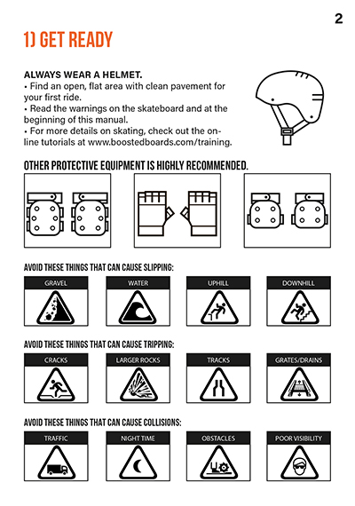
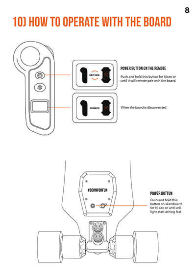

# Jetsurf skateboards
Jetsurf is a brand that claims "RACING IS OUR PASSION!" and it seems to be so. This company works in the market of electric products. Recently they have launched first JETSURF motorized skateboard series that is designed for fun and racing purposes. And I happened to be a part of this project being responsible for the design and more precisely - for the skateboard manual.

The task was to make a simple and legible manual that will correspond to Jetsurf`s style which is based on the rule "the less the better" and is using 3 main colors: black, white and orange.

# Process of creation

    

It was a pleasure for me to work with Jetsurf company. Everyone has been responsive, outgoing and clear about their vision of the final product. The only requirement from the brand was to use Acumin Pro font which gave me a huge artistic freedom.

The process of creation took me about a month including all the meetings with the client and adjustments I had to constantly make until the point where the client was finally fully satisfied with the results.

# The result

Jetsurf has launched it`s product "Airy" motorized skateboards along with the manual I provided to them in order to give the customers precise idea of how to use their product.

             
