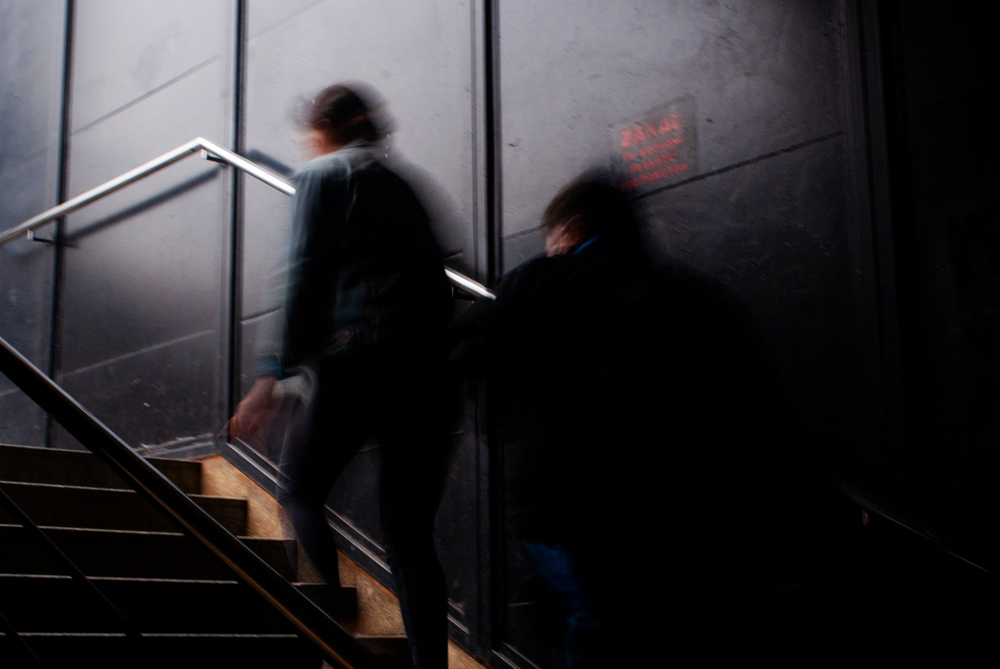

# Alexandra Kakushina
## Find out some info about me!

  
  

  
  I'm glad to see you on my page. Let me give you some basic information about me as an appetizer: I'm a graphic designer that is focused on branding and who is not scared of experimenting with incompatible elements. 

- [Composition](https://github.com/AlexandraKak/english-for-designers/blob/049d506a797ec153c32ce0a7d755db40ee060cfa/00-composition/index.md) - small list of the actions that are required in order to draw a cute house
- [Letter-description](https://github.com/AlexandraKak/english-for-designers/blob/85a9af765dad9c71010fd9130a62c53b6a5db7b6/01-letter-description/index.md) - 3D letter made from different layers in Blender
- [Aboutness](https://github.com/AlexandraKak/english-for-designers/blob/a2eefd37ab9d0cadbab0d4f2733c91fd9704d5ee/03-aboutness/index.md) - Something you probably didn't know about me yet
- [Case study](https://github.com/AlexandraKak/english-for-designers/blob/a2eefd37ab9d0cadbab0d4f2733c91fd9704d5ee/03-aboutness/case-study.md) - Check out one of my projects 
- [CV](https://github.com/AlexandraKak/english-for-designers/blob/a2eefd37ab9d0cadbab0d4f2733c91fd9704d5ee/04-CV/index.md) - In case you want to hire me
- [Storytelling](https://github.com/AlexandraKak/english-for-designers/blob/a2eefd37ab9d0cadbab0d4f2733c91fd9704d5ee/06-storytelling/index.md) - More precise information about me and my past along with the experince I got. 

## Takeaways:
1. The article doesn`t neccessarily have to be complex. 
2. Polite language doesn't mean interesting.
3. You have to be as creative with writing as with graphic design.

